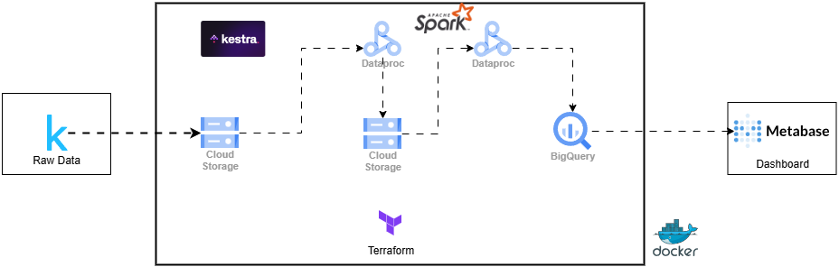
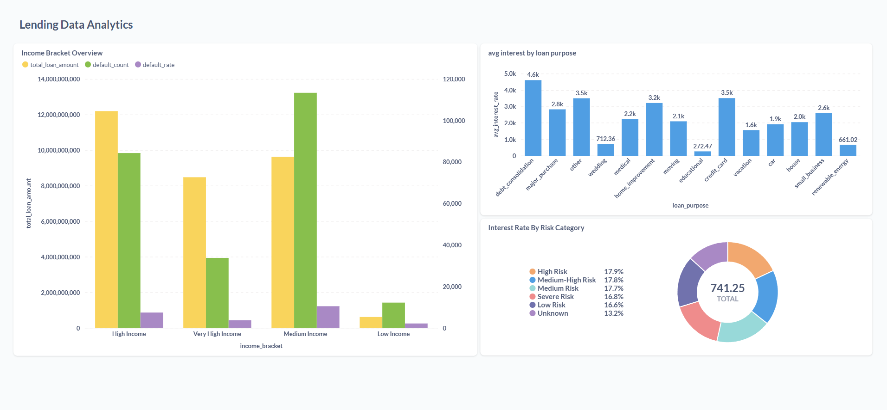
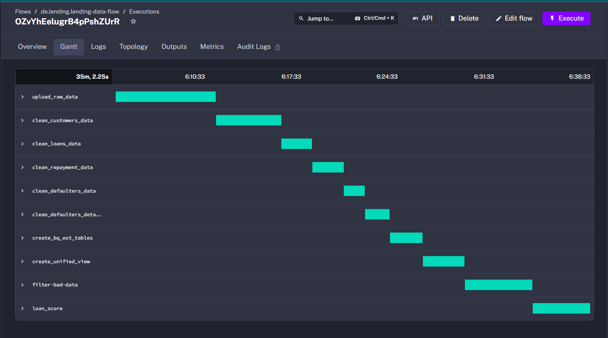

# 📊 Lending Data Analytics Project

[](https://cloud.google.com/)
[](https://spark.apache.org/docs/latest/api/python/)
[](https://cloud.google.com/bigquery)
[](https://kestra.io/)

## 🔍 Problem Description

This project addresses the challenges in the lending industry by creating an end-to-end data pipeline for processing and analyzing lending club data. It enables financial institutions to:

- ✅ Process and clean large volumes of lending data for analysis
- ✅ Identify patterns in loan defaults and repayments
- ✅ Create risk profiles for borrowers
- ✅ Generate loan scores to assess the quality of loans
- ✅ Provide actionable insights through analytics dashboards

The platform helps lending institutions make better-informed decisions, reduce default risks, and optimize their lending strategies through data-driven insights.

## 🏗️ Architecture



## ☁️ Cloud Infrastructure

This project is fully developed in the Google Cloud Platform (GCP) with Infrastructure as Code (IaC) principles using:

| Component | Purpose |
|-----------|---------|
| **Google Cloud Storage (GCS)** | Data lake for raw and processed data |
| **Google Dataproc** | Managed Spark service for data processing |
| **BigQuery** | Data warehouse |
| **Metabase** | Data visualization and dashboards |
| **Terraform** | Infrastructure as Code for reproducible environments |
| **Kestra** | Workflow Orchestration |
| **Docker** | Containers |

## 📥 Data Ingestion and Workflow Orchestration

The project implements a comprehensive batch data processing pipeline with:

1. Data ingestion from source to GCS data lake
2. Multiple transformation steps with dependencies
3. Orchestrated workflow using Kestra


The data pipeline is structured as a sequence of PySpark jobs:


Each step is a PySpark job submitted to Dataproc with appropriate dependencies using Kestra orchestrator.

## 🗄️ Data Warehouse (BigQuery)

- Tables are partitioned by date fields (e.g., loan issue date)
- Clustered by frequently queried fields (e.g., member_id, loan_status)
- Star schema design with fact and dimension tables for efficient querying

This structure optimizes query performance for the analytics use cases, reducing query costs and improving response time.

## 🔧 Data Transformations

The project uses Spark for comprehensive data transformations:

- Data cleaning and normalization
- Feature engineering for analytics
- Complex aggregations and calculations
- Creation of unified views for analytics

PySpark scripts handle all transformations with a focus on scalability and performance.

## 📊 Dashboard

The analytics dashboard in Metabase provides:

   - Distribution of loans by status, grade, and purpose
   - Temporal trends in loan issuance and repayment
   - Default rate analysis by demographic segments
   - Loan score distribution and risk categorization



## 🔄 Reproducibility

### Prerequisites

- Google Cloud Platform account with billing enabled
- `gcloud` CLI installed and configured
- Terraform installed (for infrastructure setup)


### Setup Instructions

1. **Clone the repository**
   ```bash
   git clone https://github.com/abhayra12/lending_data_analytics.git
   cd lending-data-analytics
   ```

2. **Set up GCP credentials**
   ```bash
   # Set up a service account with appropriate permissions and download the JSON key
   # Save it as gcp-creds.json in the project root
   export GOOGLE_APPLICATION_CREDENTIALS="$(pwd)/gcp-creds.json"
   ```

3. **Deploy infrastructure with Terraform**
   ```bash
   cd terraform
   terraform init
   terraform apply
   ```

4. **Upload initial data to GCS**
   
   I have created a consolidated script for downloading Kaggle data and uploading scripts to GCS:
   
   ```bash
   # Install required dependencies
   pip install -r requirements.txt
   
   # Download Kaggle data and upload to GCS
   python scripts/gcs_upload.py lending_ara --kaggle
   
   # Upload Python scripts to GCS
   python scripts/gcs_upload.py lending_ara --scripts
   
   # Or do both at once
   python scripts/gcs_upload.py lending_ara --all
   ```

   This script:
   - Downloads the Lending Club dataset from Kaggle directly to your local `data/` folder
   - Automatically finds the CSV files in the downloaded dataset
   - Copies the target CSV file (accepted_2007_to_2018Q4.csv) to your data directory
   - Uploads the CSV file to the GCS bucket
   - Optionally uploads all Python scripts to the `code/` folder in the GCS bucket
   
   > **Note**: You need to have Kaggle credentials configured before running this script.

5. **Run the data pipeline**

   I have created a Kestra workflow for the data pipeline.
   Start the Kestra Service by running the following command:
   ```bash
   cd docker/kestra
   docker compose up -d
   ```
   Go to the Kestra UI by running the following command:
   ```bash
   open http://localhost:8080
   ```
   copy the flows from `docker/kestra/flows` to the Kestra UI.
   execute the flows in the kestra ui.

   
   

6. **Access the dashboard**
   ```bash
   cd docker/metabase
   docker compose up -d
   
   # Open in browser
   open http://localhost:3000
   ```
   Create a new Metabase account and login.
   Select the `Lending Club` database and the `loan_data` table.

### Troubleshooting

| Issue | Resolution |
|-------|------------|
| Dataproc job submission fails | Check the cluster logs |
| BigQuery access issues | Verify service account permissions |
| Data related issues | Check the intermediate outputs in GCS |

## 🚀 Future Enhancements

- Add real-time data processing for immediate insights

## 👨‍💻 Contributors

- [Abhay](https://github.com/abhayra12)